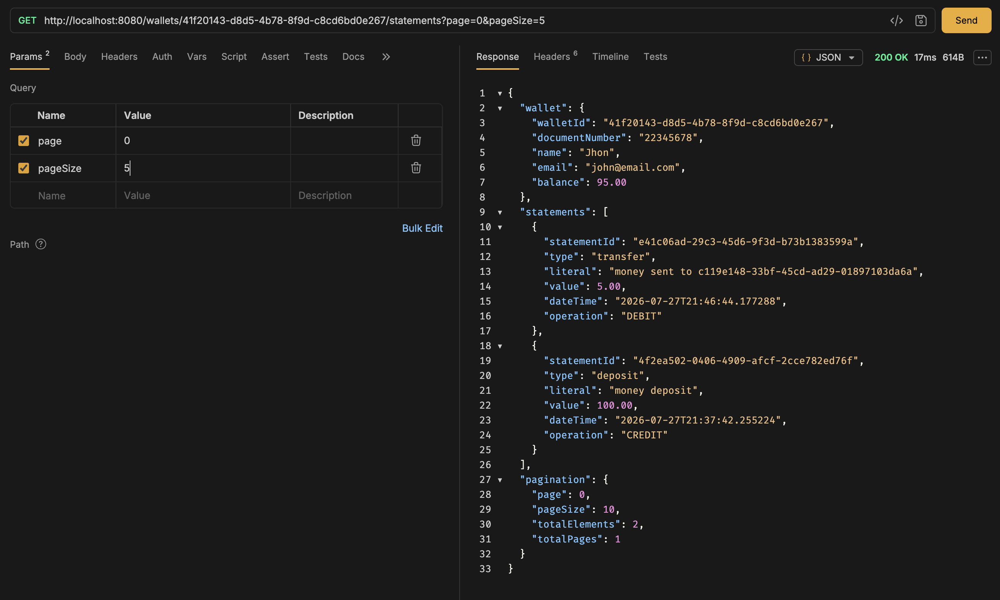
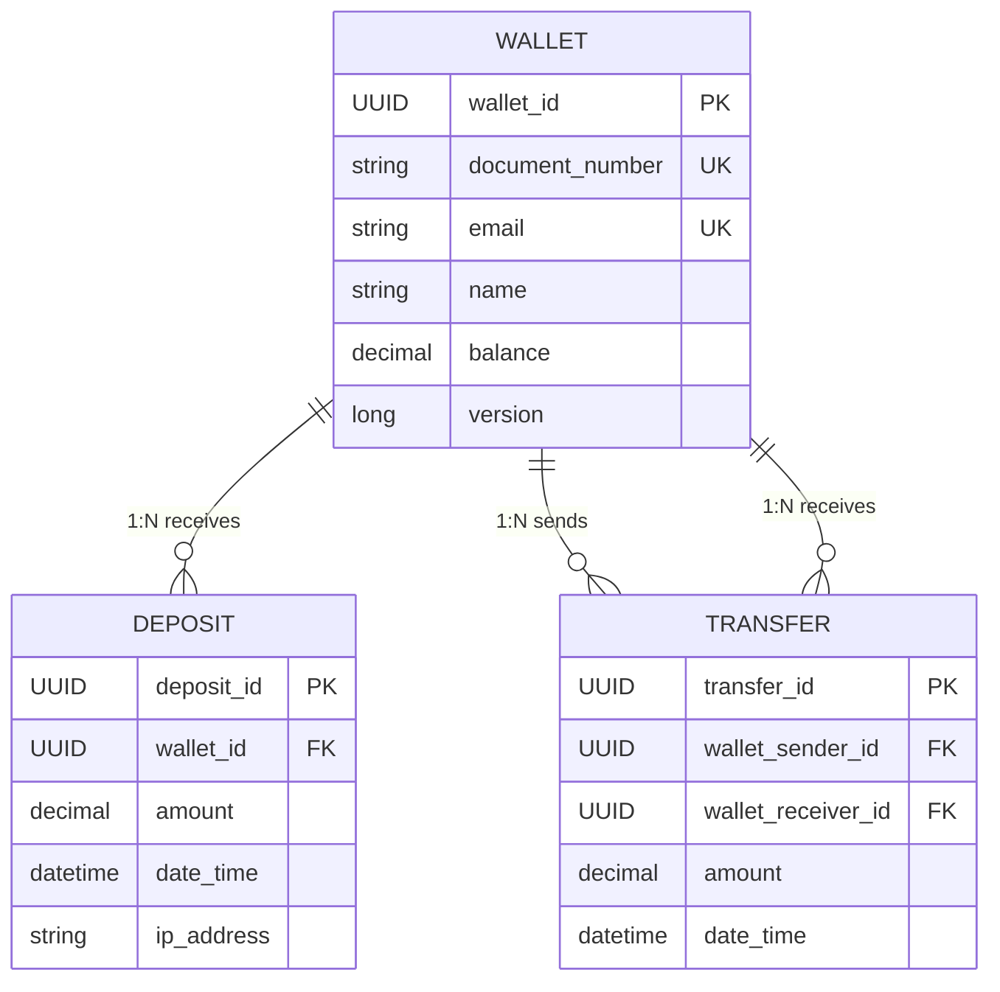

# JBank

JBank is a portfolio REST API that models a small digital-wallet service. It demonstrates practical backend development with:

- Filters and interceptors for request and response handling and auditing.
- Spring Web architecture and custom handler creation.
- Advanced validation with Hibernate Validator and exception handling.
- Techniques for transaction integrity and concurrency control.
- Advanced queries with JPA projections to optimize complex queries.
- Structured `ProblemDetail` responses for domain and validation errors.

## Tech stack
- Java 21
- Spring Boot 4
- Spring Web MVC and Bean Validation
- Spring Data JPA / Hibernate
- MySQL
- Docker Compose
- Maven Wrapper

## Features and business rules

- Create wallets with a unique document number and email address. New wallets start with a zero balance.
- Deposit positive amounts into a wallet. Every deposit records its amount, timestamp, target wallet, and originating IP address.
- Transfer positive amounts between wallets. The operation updates both balances and records the transfer in a single database transaction.
- Reject transfers when the sender has insufficient funds.
- Delete a wallet only when its balance is zero.
- Retrieve a paginated statement through the statements endpoint. It combines deposits with incoming and outgoing transfers, orders them from newest to oldest, and returns pagination metadata.
- Capture the client IP address in an `x-user-ip` response header and include it in audit logs together with the HTTP method, URL, and response status.
- Return structured `ProblemDetail` responses for domain and validation errors.

### Statement request example

The following Bruno request demonstrates a paginated wallet statement response with both debit and credit entries.



## Reliability and request processing

### Transactional operations and optimistic locking

The deposit and transfer service methods use Spring's `@Transactional` annotation. It defines a database transaction around each operation: the related balance updates and transaction record are committed together, or rolled back together if a runtime error occurs. This preserves consistency during multi-step financial operations.

`Wallet` uses JPA's `@Version` annotation. Hibernate maintains a version value for each wallet and checks it when updating the row. If two requests try to persist conflicting changes to the same wallet, the later conflicting update is detected instead of silently overwriting the earlier one. This is optimistic locking; the application does not lock the row while it is being read, and a client can retry after a conflict.

### IP filtering and request auditing

An HTTP filter runs for every request and captures the remote IP address. It stores the value as the `x-user-ip` request attribute and returns it in the `x-user-ip` response header. Deposit operations use this captured address when creating a deposit record.

After request processing, a Spring MVC interceptor writes an audit log entry containing the HTTP method, request URL, response status, and captured IP address. Together, the filter and interceptor provide request-level traceability across the API.

## Data model

A wallet can have many deposits and participate in many transfers. Each transfer has exactly one sender wallet and one receiver wallet; therefore, the wallet-to-transfer relationship is one-to-many for both roles.



## Run locally

### Prerequisites

- Java 21
- Docker and Docker Compose

Maven is not required globally because the repository includes the Maven Wrapper.

### Start the database

```bash
docker compose -f docker/docker-compose.yml up -d
```

This starts MySQL.

### Start the API

```bash
./mvnw spring-boot:run
```

The API is available at `http://localhost:8080`. Hibernate creates or updates the required tables at startup.


To stop the database container:

```bash
docker compose -f docker/docker-compose.yml down
```

## API reference

| Method | Endpoint | Request | Success response |
| --- | --- | --- | --- |
| `POST` | `/wallets` | `documentNumber`, `email`, `name` | `201 Created` with a `Location` header for the new wallet. |
| `DELETE` | `/wallets/{walletId}` | None | `204 No Content` when the wallet balance is zero. |
| `POST` | `/wallets/{walletId}/deposits` | `value` (minimum `0.01`) | `200 OK` after recording the deposit and crediting the wallet. |
| `POST` | `/transfers` | `sender`, `receiver` (wallet UUIDs), `value` (minimum `0.01`) | `200 OK` after debiting the sender and crediting the receiver. |
| `GET` | `/wallets/{walletId}/statements` | Optional query parameters: `page` (default `0`) and `pageSize` (default `10`) | `200 OK` with wallet details, statement items, and pagination metadata. |


### Example: create a wallet

```bash
curl -i -X POST http://localhost:8080/wallets \
  -H 'Content-Type: application/json' \
  -d '{
    "documentNumber": "22345678",
    "email": "john@example.com",
    "name": "John Doe"
  }'
```

## API client collection

The [`http-collection/`](http-collection/) directory contains a Bruno collection with ready-made requests for: 
- health checking
- wallet creation and deletion
- deposits
- transfers
- statements

Import that directory into [Bruno](https://www.usebruno.com/) to test the API locally.
